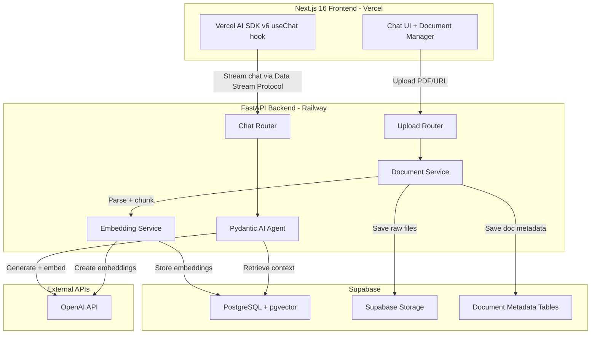

# InsightFlow AI
> A personalized Research Agent that lets users upload PDFs/URLs and chat with them in real-time.  
> Built as a portfolio project for a Junior Full Stack Dev position in Toronto.
---
## Tech Stack
| Layer          | Tech                                                          | Why                                                                     |
| -------------- | ------------------------------------------------------------- | ----------------------------------------------------------------------- |
| Frontend       | Next.js 16, TypeScript, Tailwind CSS v4, shadcn/ui            | Industry standard for Toronto startups                                  |
| Chat Streaming | Vercel AI SDK v6 (`useChat` hook)                             | Handles streaming + chat state out of the box                           |
| Backend        | FastAPI, Python 3.12+                                         | Clean async API, native Pydantic integration                            |
| AI Agent       | Pydantic AI                                                   | Type-safe agent orchestration, built-in `VercelAIAdapter` for streaming |
| Doc Processing | `langchain-community` doc loaders, `langchain-text-splitters` | Best PDF/URL loaders available, no need to reinvent                     |
| Embeddings     | OpenAI `text-embedding-3-small`                               | Cheap ($0.02/1M tokens), high quality                                   |
| LLM            | OpenAI `gpt-4o-mini`                                          | ~$0.15/1M input tokens, fast, smart enough for RAG                      |
| Database       | Supabase (PostgreSQL + pgvector)                              | Production-grade, vectors + metadata + file storage in one place        |
---
## Architecture

---
## Build Log
### Phase 1: Project Scaffolding
**Goal:** Get both apps running locally with a health-check endpoint connected, git initialized, and Supabase project ready.
#### What We Built
Phase 1 was all about laying a solid foundation. We wanted two servers talking to each other before writing a single line of AI logic.
**Backend — FastAPI with a health endpoint**
We start by creating the FastAPI backend inside `backend/app/main.py`. We will keep it minimal on purpose: a CORS middleware configured to accept requests from our frontend, a `/health` endpoint that returns a simple JSON status, and a root endpoint. The idea was to get something running at `localhost:8000` so that we could immediately test against.
```python
app = FastAPI()
app.add_middleware(
    CORSMiddleware,
    allow_origins=["*"],
    allow_credentials=True,
    allow_methods=["*"],
    allow_headers=["*"],
)
@app.get("/health")
async def health_check():
    return {"status": "ok", "message": "API is running"}
```
We also created the `.env` file with placeholders for `OPENAI_API_KEY`, `SUPABASE_URL`, and `SUPABASE_KEY`. Even thought it's  not needed yet, but we wanted the backend ready to connect to external services when the time comes.
**Frontend — Next.js 16 with shadcn/ui**
We scaffolded the frontend using `create-next-app@latest`, which gave us Next.js 16 with Turbopack out of the box (~87% faster dev startup). We went with TypeScript, Tailwind CSS v4, the App Router, and a `src/` directory structure.
Next, we initialized shadcn/ui with the Radix Nova style and a Neutral color base. shadcn is different from typical component librarie. Instead of importing from `node_modules`, it copies the actual component source code into our `src/components/ui/` folder. We own the code and can customize it freely. We added three components right away:
- **Button** — with full variant support (`default`, `outline`, `destructive`, `ghost`, `link`) and multiple sizes
- **Card** — for structured content display
- **Badge** — for status indicators
We also installed the Vercel AI SDK v6 (`ai`, `@ai-sdk/react`, `@ai-sdk/openai`). We won't be using it yet, but ready for when we build the chat streaming pipeline.
**The health check connection**
The `page.tsx` landing page was our proof that the two servers could talk. We built a simple health check card using the shadcn `Card`, `Badge`, and `Button` components. On mount, it fires a `fetch` to `${NEXT_PUBLIC_API_URL}/health` and shows a live status indicator — green "Connected" badge when the backend is up, red "Disconnected" when it's not, with a re-check button to manually retry. This is small, but it confirmed our full-stack wiring was correct before we moved on.
**Environment variables**
We set up `.env.local` on the frontend with `NEXT_PUBLIC_API_URL=http://localhost:8000` so the API URL is configurable per environment. On the backend, `.env` holds the Supabase and OpenAI credentials (gitignored, of course).
**Supabase project**
We created a Supabase project on the free tier and enabled the `pgvector` extension via the SQL Editor (`CREATE EXTENSION IF NOT EXISTS vector`). We also set up a Storage bucket called `documents` for uploaded PDFs. Table creation is deferred to Phase 3 as we don't need them yet, and we didn't want to create schema we'd have to change later.
**Git & .gitignore**
We initialized the git repo and created a `.gitignore` that covers Python (`__pycache__/`, `venv/`, `.env`), Node (`node_modules/`, `.next/`), and IDE files (`.vscode/`, `.idea/`). Clean history from day one.
#### Branch & PR Workflow with CodeRabbit
We set up a professional branch and PR workflow that we'll follow for every phase going forward. The idea is simple: never commit directly to `main`. Instead, we create a feature branch, build on it, push it, and open a Pull Request. 
We also installed [CodeRabbit](https://coderabbit.ai). A free AI code reviewer for open-source repos. Once installed on the GitHub repo, it automatically reviews every PR we open. No configuration needed.
Here's what our workflow looks like in practice:
**1. Create a branch from `main`:**
```bash
git checkout -b phase-1/project-scaffolding
```
**2. Build the feature and make focused commits:**
```bash
git add .
git commit -m "Add FastAPI app with health endpoint and CORS"
```
**3. Push and open a PR on GitHub:**
```bash
git push -u origin phase-1/project-scaffolding
```
**4. CodeRabbit reviews the PR automatically.** Here's an example of what that looks like:
> **CodeRabbit Review Summary**
>
> **Walkthrough:** This PR scaffolds the project with a FastAPI backend and a Next.js 16 frontend. The backend exposes a `/health` endpoint with CORS enabled. The frontend uses shadcn/ui components to display a health check card that connects to the backend.
>
> **Changes:**
> | File | Summary |
> |------|---------|
> | `backend/app/main.py` | New FastAPI app with CORS and health endpoint |
> | `frontend/src/app/page.tsx` | Health check UI with status badge and retry |
> | `frontend/package.json` | Added Vercel AI SDK, shadcn, lucide-react |
>
> **Inline comments:**
>
> `backend/app/main.py`:
> > **Suggestion:** Consider restricting `allow_origins` to `["http://localhost:3000"]` instead of `["*"]` during development. The wildcard is fine for now, but tightening CORS early prevents issues when you deploy.
>
> `frontend/src/app/page.tsx`:
> > **Note:** The `useEffect` with `checkHealth()` is missing a dependency array lint suppression or a `useCallback` wrapper. Since `checkHealth` is stable (no external deps that change), this works, but a `useCallback` would make the intent clearer.
>
> > **Suggestion:** Consider adding error boundary handling or a timeout to the `fetch` call so the UI doesn't hang if the backend is slow to respond.
**5. We read the feedback, learn from it, and push fixes:**
```bash
git add .
git commit -m "Tighten CORS origins and add useCallback to health check"
git push
```
CodeRabbit re-reviews the new changes automatically.
**6. Merge the PR into `main` once satisfied:**
```bash
# On GitHub: click "Merge pull request"
# Then locally:
git checkout main
git pull
```
This gives our repo a clean history of PRs with code review discussions — exactly what a hiring manager expects to see from a professional workflow.
#### Phase 1 Project Structure
```
insight-flow-ai/
├── .gitignore
├── README.md
├── backend/
│   ├── .env                          # OPENAI_API_KEY, SUPABASE_URL, SUPABASE_KEY
│   └── app/
│       └── main.py                   # FastAPI app + CORS + /health endpoint
└── frontend/
    ├── .env.local                    # NEXT_PUBLIC_API_URL=http://localhost:8000
    ├── components.json               # shadcn/ui config (Radix Nova, Neutral, Lucide)
    ├── eslint.config.mjs
    ├── next.config.ts
    ├── package.json                  # Next.js 16, Vercel AI SDK v6, shadcn, Tailwind v4
    ├── postcss.config.mjs
    ├── tsconfig.json
    ├── public/
    │   ├── file.svg
    │   ├── globe.svg
    │   ├── next.svg
    │   ├── vercel.svg
    │   └── window.svg
    └── src/
        ├── app/
        │   ├── favicon.ico
        │   ├── globals.css           # Tailwind v4 + shadcn theme (Zinc palette, dark mode)
        │   ├── layout.tsx            # Root layout with Geist font
        │   └── page.tsx              # Health check card (connects to FastAPI)
        ├── components/
        │   └── ui/
        │       ├── badge.tsx         # shadcn Badge component
        │       ├── button.tsx        # shadcn Button (6 variants, 8 sizes)
        │       └── card.tsx          # shadcn Card component
        └── lib/
            └── utils.ts              # cn() utility (clsx + tailwind-merge)
```
#### Phase 1 Deliverable
Two running servers (`localhost:3000` + `localhost:8000` that can talk to each other, with a live health check UI confirming the connection. 